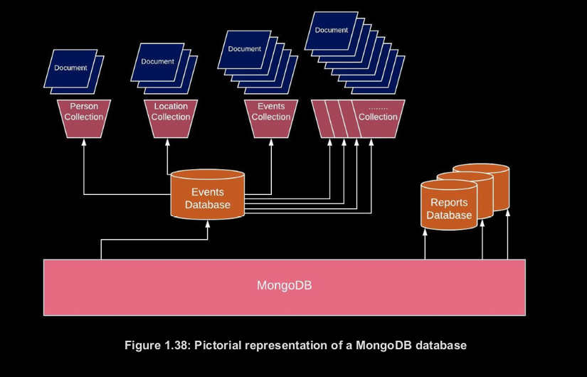

<p align="center">
  <a href="http://nestjs.com/" target="blank"></a>
</p>

## Documents
<p align="justify">MongoDB almacena registros de datos en documentos. Un documento es una colección de nombres y valores de campo,
estructurado en un formato similar a la notación de objetos de JavaScript (JSON). JSON es fácil de entender
formato de par clave-valor para describir datos. Los documentos en MongoDB se almacenan como una extensión de
el tipo JSON, que se llama BSON (Binary JSON). Es una serialización codificada en binario de JSON 
como documentos. BSON está diseñado para ser más eficiente en el espacio que JSON estándar. BSON también
contiene extensiones que permiten la representación de tipos de datos que no se pueden representar en
JSON.</p>

## Document Structures
<p align="justify">
Los documentos de MongoDB contienen pares de campo y valor y siguen una estructura básica, de la siguiente manera:
</p>

```json
{
    "firstFieldName" : firstFieldValue,
    "secondFieldName": secondFieldValue,
    …
    "nthFieldName"   : nthFieldValue
}
```

El siguiente es un ejemplo de un documento que contiene detalles sobre una persona:

```json
{
    "_id"             :ObjectId("5da26111139a21bbe11f9e89"),
    "name"            :"Anita P",
    "placeOfBirth"    :"Koszalin",
    "profession"      :"Nursing"
}
```

el siguiente es otro ejemplo con algunos campos y tipos de fecha de BSON:

```json
{
    "_id"           : ObjectId("5da26553fb4ef99de45a6139"),
    "name"          : "Roxana",
    "dateOfBirth"   : new Date("Dec 25, 2007"),
    "placeOfBirth"  : "Brisbane",
    "profession"    : "Student"
}
```

<p align="justify">
El siguiente ejemplo de un documento contiene una matriz y un subdocumento. Una matriz es un conjunto de
valores y se puede usar cuando necesita almacenar múltiples valores para una clave, como pasatiempos. Subdocumentos le permiten envolver atributos relacionados en un documento contra una clave, como una dirección:
</p>

```json
{
    "_id"         : ObjectId("5da2685bfb4ef99de45a613a"),
    "name"        : "Helen",
    "dateOfBirth" : new Date("Dec 25, 2007"),
    "placeOfBirth": "Brisbane",
    "profession"  : "Student",
    "hobbies"     : [
                      "painting",
                      "football",
                      "singing",
                      "story-writing"
    ],
    "address"     : {
        "city"    : "Sydney",
        "country" : "Australia",
        "postcode": 2161
    }
}
```


<p align="justify">
MongoDB genera automáticamente el campo _id que se muestra en el fragmento anterior y se utiliza como
identificador único para el documento. Aprenderemos más sobre esto en los próximos capítulos.
</p>


## Collections
<p align="justify">
En MongoDB, los documentos se almacenan en colecciones. Las colecciones son análogas a las tablas en relaciones
bases de datos Debe usar el nombre de la colección en sus consultas para operaciones como insertar,
recuperar, eliminar, etc.
</p>

## Understanding MongoDB Databases
<p align="justify">
Una base de datos es un contenedor de colecciones agrupadas. Cada base de datos tiene varios archivos en el
sistema de archivos que contiene metadatos de la base de datos y los datos reales almacenados en las colecciones. MongoDB
le permite tener múltiples bases de datos, y cada una de estas bases de datos puede tener varias colecciones.
A su vez, cada una de estas colecciones puede tener numerosos documentos. Esto se ilustra en la siguiente
figura, que muestra una base de datos de eventos que contiene colecciones para diferentes campos relacionados con eventos,
como Persona, Ubicación y Eventos; éstos, a su vez, contienen diversos documentos con todas las
datos granulares:
</p>

<p align="center">

</p>

## Creating a Database

<p align="justify">
Crear una base de datos en MongoDB es muy sencillo. Ejecute el comando de uso en el shell mongo como
etcsiguiente, reemplazando yourDatabaseName con su propia elección de nombre de base de datos:
</p>

```json
use yourDatabaseName
```


<p align="justify">
Si la base de datos no existe, Mongo creará la base de datos y cambiará la base de datos actual
a la nueva base de datos. Si la base de datos existe, Mongo se referirá a la base de datos existente. Aquí está el
salida del último comando:
</p>

```json
switched to db yourDatabaseName
```


## Creating a Collection


<p align="justify">
Puede usar el comando createCollection para crear una colección. Este comando le permite
para utilizar diferentes opciones para su colección, como una colección limitada, validación, intercalación y
etc. Otra forma de crear una colección es simplemente insertando un documento en un lugar inexistente.
recopilación. En tal caso, MongoDB verifica si la colección existe y, de no ser así, creará
la colección antes de insertar los documentos pasados. Intentaremos utilizar ambos métodos para crear un
recopilación.
</p>

Para crear la colección explícitamente, use la operación createCollection en la sintaxis de la siguiente manera:

```js
db.createCollection( '<collectionName>',
{
        capped: <boolean>,
        autoIndexId: <boolean>,
        size: <number>,
        max: <number>,
        storageEngine: <document>,
        validator: <document>,
        validationLevel: <string>,
        validationAction: <string>,
        indexOptionDefaults: <document>,
        viewOn: <string>,
        pipeline: <pipeline>,
        collation: <document>,
        writeConcern: <document>
})
```

<p align="justify">
En el siguiente fragmento, estamos creando una colección limitada con un máximo de 5 documentos, con
cada documento tiene un límite de tamaño de 256 bytes. La colección limitada funciona como una cola circular,
lo que significa que los documentos más antiguos saldrán para hacer espacio para las últimas inserciones cuando se agote el máximo.
se alcanza el tamaño:
</p>

```js
db.createCollection('myCappedCollection',
{
    capped: true,
    size: 256,
    max: 5
})
```

Aquí está el resultado del comando createCollection:

```
{
    «ok» : 1,
    «$clusterTime» : {
    «clusterTime» : Timestamp(1592064731, 1),
    «signature» : {
    «hash» : BinData(0,»XJ2DOzjAagUkftFkLQIT
    9W2rKjc="),
    «keyId» : NumberLong(«6834058563036381187»)
}
},
    «operationTime» : Timestamp(1592064731, 1)
}
```
<p align="justify">
No te preocupes mucho por las opciones anteriores ya que ninguna de ellas es obligatoria. si no necesitas
para configurar cualquiera de estos, entonces su comando createCollection se puede simplificar de la siguiente manera:
</p>

```
{
    «ok» : 1,
    «$clusterTime» : {
        «clusterTime» : Timestamp(1597230876, 1),«signature» : {
            «hash» : BinData(0,»YO8Flg5AglrxCV3XqEuZG
            aaLzZc="),
            «keyId» : NumberLong(«6853300587753111555»)
        }
    },
    «operationTime» : Timestamp(1597230876, 1)
}
```

## Creating a Collection Using Document Insertion

<p align="justify">
No necesita crear una colección antes de insertar documentos. MongoDB crea una colección si
no existe en la primera inserción del documento. Usarías este método de la siguiente manera:
</p>

```sh
use yourDatabaseName;
db.myCollectionName.insert(
{
    "name" : "Yahya A", "company" : "Sony"}
);
```

La salida de su comando debería verse así:
```
WriteResult({ "nInserted" : 1 })
```

<p align="justify">
El resultado anterior devuelve el número de documentos insertados en la colección. Ya que tienes
insertó un documento en una colección inexistente, MongoDB debe haber creado la colección para nosotros
antes de insertar este documento. Para confirmar eso, muestre su lista de colecciones usando lo siguiente
dominio:
</p>

```
show collections;
```
<p align="justify">
la salida de su comando debería mostrar la lista de colecciones en su base de datos, algo así como
este:
</p>

```
myCollectionName
```

## Creating Documents

<p align="justify">
Como habrás notado en la sección anterior, usamos el comando insertar para poner un
documento en una colección. Veamos un par de variantes de los comandos de inserción.
</p>

## Inserting a Single Document
El comando insertOne se usa para insertar un documento a la vez, como en la siguiente sintaxis:

```json
db.blogs.insertOne({   
    username: "Zakariya", 
    noOfBlogs: 100, 
    tags: ["science", "fiction"]
})
```

La operación insertOne devuelve el valor _id del documento recién insertado. Aquí está el
salida del comando insertOne:

```json
{
    "acknowledged" : true,
    "insertedId" : ObjectId("5ea3a1561df5c3fd4f752636")
}
```

## Inserting Multiple Documents
<p align="justify">
El comando insertMany inserta varios documentos a la vez. Puede pasar una serie de
documentos al comando como se menciona en el siguiente fragmento:
</p>

```json
db.blogs.insertMany(
[
    { 
        username: "Thaha", 
        noOfBlogs: 200, 
        tags: ["science","robotics"]},
    { 
        username: "Thayebbah", 
        noOfBlogs: 500, 
        tags: ["cooking", "general knowledge"]
    },
    { 
        username: "Thaherah", 
        noOfBlogs: 50, 
        tags: ["beauty", "arts"]
    }
])
```
<p align="justify">
La salida devuelve los valores _id de todos los documentos recién insertados:
</p>

```json
{
    «acknowledged» : true,
    «insertedIds» : [
            ObjectId(«5f33cf74592962df72246ae8»),
            ObjectId(«5f33cf74592962df72246ae9»),
            ObjectId(«5f33cf74592962df72246aea»)
    ]
}
```

## Fetching Documents from MongoDB

<p align="justify">
MongoDB proporciona el comando de búsqueda para obtener documentos de una colección. Este comando es
útil para verificar si sus inserciones están realmente guardadas en las colecciones. Aquí está la sintaxis para el
encontrar comando:
</p>

```json
db.collection.find(query, projection)
```
<p align="justify">
El comando toma dos parámetros opcionales: consulta y proyección. El parámetro de consulta
le permite pasar un documento para aplicar filtros durante la operación de búsqueda. la proyección
El parámetro le permite elegir los atributos deseados de los documentos devueltos en lugar de todos los
atributos Cuando no se pasa ningún parámetro en el comando de búsqueda, todos los documentos se
devuelto
</p>