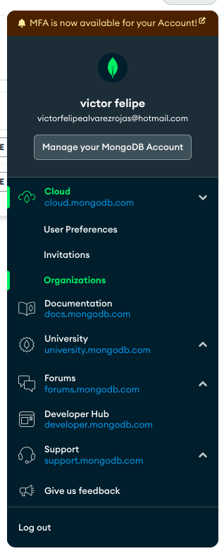

<p align="center">
  <a href="http://nestjs.com/" target="blank"></a>
</p>

> ## Setting Up a MongoDB Atlas
>   ```bash
> 1._ https://www.mongodb.com and click Start free
> 2._ registrarse usando su cuenta de Google
> 3._ ingresar su organización y los detalles del proyecto
> 4._ seleccionar plan(FREE) 
>
>             << creó con éxito su cuenta MongoDB!! >> 
>```


## MongoDB Atlas Organizations, Projects, Users,and Clusters

<p> MongoDB Atlas aplica una estructura básica para su entorno. Esto incluye los conceptos de organizaciones, proyectos, usuarios y clústeres. MongoDB proporciona una organización predeterminada y un proyecto para ayudarlo a comenzar fácilmente. </p>


## Organizations 

<p>Una organización de MongoDB Atlas es la entidad de nivel superior en su cuenta, que contiene otros elementos
como proyectos, clústeres y usuarios. Primero debe configurar una organización antes que cualquier otra.
recursos.

Para crear una organización, seleccione la opción Organizaciones de su cuenta, nueva organizacion

selección para Cloud Service como MongoDB Atlas. Haga clic en Siguiente para continuar con el siguiente paso:


</p>




## Projects
<p>Un proyecto proporciona una agrupación de clústeres y usuarios para un propósito específico; por ejemplo, segregar sus entornos de laboratorio, demostración y producción. Del mismo modo, te puede gustar un diferente
configuración de red, región y usuario para diferentes entornos. Los proyectos le permiten hacer esta agrupaciónsegún sus propias necesidades organizativas.

1._ Haga clic en Nuevo proyecto:
    La página Agregar miembros y establecer permisos no está
obligatorio, así que déjelo como predeterminado. Su nombre debe aparecer como Propietario del proyecto

</p>

## MongoDB Clusters
<p>Un clúster de MongoDB es el término utilizado para un conjunto de réplicas de bases de datos o implementaciones compartidas en MongoDB.
Atlas. Un clúster es un conjunto distribuido de servidores que se utiliza para el almacenamiento y la recuperación de datos. Una base de datos Mongo
el clúster, en el nivel mínimo, es un conjunto de réplicas de tres nodos. En un entorno fragmentado, un solo
el clúster puede contener cientos de nodos/servidores que contienen diferentes conjuntos de réplicas con cada réplica
conjunto compuesto por al menos tres nodos/servidores.</p>

### Setting Up Your First Free MongoDB Cluster on Atlas

<p>denytro de project crear nuevo cluster FREE y propiedades default</p>

## Connecting to Your MongoDB Atlas Cluster

<p>en el cluster creado seleccionar la opcion Connect -> connect usando mongoDB Shell (instalar mongosh en la maquina) y copiar el string connection, sin mongosh no funcionara

NOTA: tengo que configurar un usuario para mi BD y que acepte solo la Ip de mi maquina en las peticiones 


pegar el el string connection en la terminal y luego el siguente comando: show databases

</p>

```
MongoDB Enterprise Cluster0-shard-0:PRIMARY> show databases
admin 0.000GB
local 4.215GB
```


